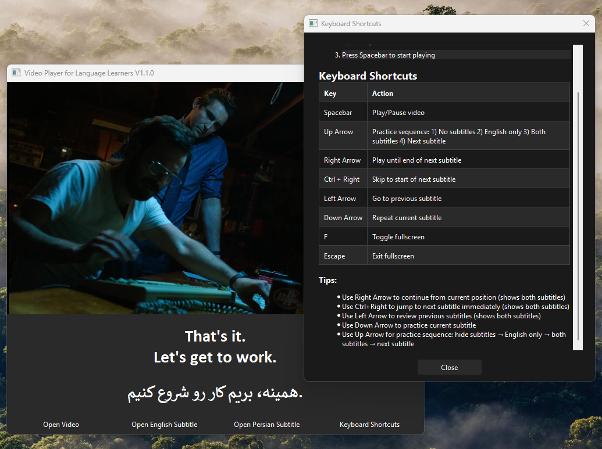

# Video Player for Language Learners

A specialized video player designed for language learning, featuring dual subtitle support and smart navigation controls. Perfect for studying languages through movies and TV shows, with synchronized English and Persian subtitles.



## About

This application was developed entirely through natural language prompting in [Cursor - The AI-First Code Editor](https://cursor.sh/)

### Key Benefits for Language Learners

- Watch videos with both English and Persian subtitles simultaneously
- Control playback based on subtitle timing for better comprehension
- Navigate through content line by line to focus on specific phrases
- Pause automatically at the end of each subtitle for practice
- Practice with a structured learning sequence (no subtitles → English only → both subtitles)
- Adjust viewing area between video and subtitles as needed

## Features

- Play MKV and MP4 video files with dual subtitle support (English and Persian)
- Smart subtitle navigation with automatic pause and resume
- Structured practice sequence for effective language learning
- Large video display with adjustable subtitle section
- Dark theme interface for comfortable viewing
- Fullscreen mode support
- Customizable layout with adjustable video/subtitle ratio

## Controls

- **Spacebar**: Toggle play/pause
- **Up Arrow**: Practice sequence (1. Hide subtitles → 2. English only → 3. Both subtitles → 4. Next subtitle)
- **Right Arrow**: Play from current position until the end of next subtitle line (shows both subtitles)
- **Ctrl + Right Arrow**: Jump to start of next subtitle line and begin playing (shows both subtitles)
- **Left Arrow**: Go to previous subtitle line and auto-resume playback (shows both subtitles)
- **Down Arrow**: Repeat current subtitle line
- **F**: Toggle fullscreen mode
- **Escape**: Exit fullscreen mode

## Requirements

- Python 3.8 or newer
- VLC Media Player 64-bit (make sure to install the same architecture - 32 or 64 bit - as your Python installation)
- Microsoft Visual C++ Build Tools
- Windows 10 or newer

## Installation

1. Make sure you have VLC Media Player installed on your system
   - Download from: <https://www.videolan.org/vlc/>
   - Install the same architecture (32 or 64 bit) as your Python installation

2. Install Microsoft Visual C++ Build Tools (if not already installed)
   - The setup script will check for this and provide download link if needed
   - When installing, select "Desktop development with C++"
   - This is required for building some Python packages

3. Clone or download this repository

4. Run the setup script:
   - Double-click `setup_and_run.bat`
   - This will automatically:
     - Check for required build tools
     - Create a Python virtual environment
     - Install all required dependencies
     - Launch the application

## Manual Installation (if setup script doesn't work)

1. Install Microsoft Visual C++ Build Tools
   - Download from: <https://visualstudio.microsoft.com/visual-cpp-build-tools/>
   - Run the installer
   - Select "Desktop development with C++"
   - Complete the installation

2. Open Command Prompt in the project directory

3. Create a virtual environment:

   ```
   python -m venv .venv
   ```

4. Activate the virtual environment:

   ```
   .venv\Scripts\activate
   ```

5. Install dependencies:

   ```
   python -m pip install --upgrade pip
   pip install wheel setuptools
   pip install -r requirements.txt
   ```

6. Run the application:

   ```
   python video_player.py
   ```

## Usage

1. Launch the application using `setup_and_run.bat` or manually running `python video_player.py`
2. Click "Open Video" to select your video file
3. Click "Open English Subtitles" to load the English subtitle file
4. Click "Open Persian Subtitles" to load the Persian subtitle file


## Usage Tips for Language Learning

1. **Initial Setup**:
   - Use `setup_and_run.bat` for first-time setup
   - For subsequent launches, use `run.bat` for quick start

2. **Study Workflow**:
   - Load your video and subtitle files
   - Use arrow keys to navigate between subtitle lines
   - Practice pronunciation during automatic pauses
   - Compare English and Persian translations
   - Use Ctrl+Right arrow to skip to next line when confident

3. **Practice Sequence (Up Arrow)**:
   - **Step 1**: Hides both subtitles - Test your listening comprehension
   - **Step 2**: Shows English subtitle only - Check your understanding
   - **Step 3**: Shows both English and Persian subtitles - Compare translations
   - **Step 4**: Moves to next subtitle with both subtitles hidden - Continue practice

4. **Layout Optimization**:
   - Adjust the splitter to balance video and subtitle visibility
   - Use fullscreen mode (F key) for immersive viewing
   - Both subtitles are clearly visible with high contrast

## Note

The video player automatically pauses at the end of each subtitle line, allowing you to focus on pronunciation and comprehension. The dual subtitle display helps in understanding context and translation simultaneously. The interface is designed for minimal distraction while maintaining all necessary controls for effective language learning.

## Latest Release

Check the [Releases](https://github.com/rabiejavadian/video-player-for-language-learners/releases) page for the latest version and pre-built executable.

## License

This project is licensed under the MIT License - see the [LICENSE](LICENSE) file for details.

## Acknowledgments

- Built with [Cursor](https://cursor.sh/) and Claude (Anthropic's AI)
- Uses VLC Media Player for video playback
- PyQt6 for the user interface
- Special thanks to the open-source community

## Support

If you encounter any issues or have questions:

1. Check the [Issues](https://github.com/rabiejavadian/video-player-for-language-learners/issues) page
2. Create a new issue if your problem isn't already listed
3. Provide as much detail as possible, including:
   - Steps to reproduce the issue
   - Error messages
   - Your system configuration

---
Developed with [Cursor](https://cursor.sh/) - The AI-First Code Editor
