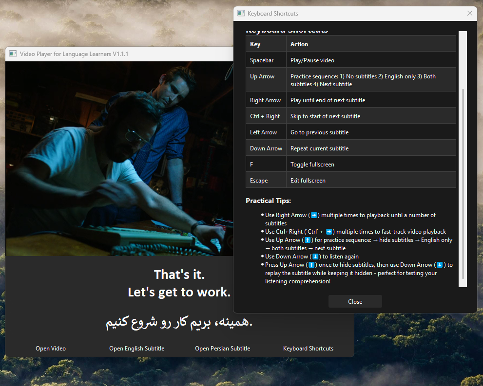

# Video Player for Language Learners

A specialized video player designed for language learning, featuring dual subtitle support and navigation controls. Perfect for studying languages through movies and TV shows. 
If your subtitles are not synchronized with the video, you can sync them using VLC, PotPlayer, or any other video player, then save the modified subtitle files to use in this application.



## About

This application was developed entirely through natural language prompting in [Cursor - The AI-First Code Editor](https://cursor.sh/)

### Key Benefits for Language Learners

- Watch videos with both English and Persian subtitles simultaneously
- Control playback based on subtitle timing for better comprehension
- Pause automatically at the end of each subtitle for practice
- Practice with a structured learning sequence (no subtitles → English only → both subtitles)

## Features

- Play MKV and MP4 video files with dual subtitle support (English and Persian)
- Dark theme interface for comfortable viewing
- Fullscreen mode support

## Controls

- **Spacebar**: Toggle play/pause
- **Up Arrow**: Practice sequence (1. Hide subtitles → 2. English only → 3. Both subtitles → 4. Next subtitle)
- **Right Arrow**: Play from current position until the end of next subtitle line (shows both subtitles)
- **Ctrl + Right Arrow**: Jump to start of next subtitle line and begin playing (shows both subtitles)
- **Left Arrow**: Go to previous subtitle line and auto-resume playback (shows both subtitles)
- **Down Arrow**: Repeat current subtitle line
- **F**: Toggle fullscreen mode
- **Escape**: Exit fullscreen mode

## Practical Tips
- Use Right Arrow (➡️) multiple times to playback until a number of subtitles
- Use Ctrl+Right (`Ctrl` + ➡️) multiple times to fast-track video playback
- Use Up Arrow (⬆️) for practice sequence: hide subtitles → English only → both subtitles → next subtitle
- Use Down Arrow (⬇️) to listen again
- Press Up Arrow (⬆️) once to hide subtitles, then use Down Arrow (⬇️) to replay the subtitle while keeping it hidden - perfect for testing your listening comprehension!

## Requirements

- Python 3.8 or newer
- VLC Media Player 64-bit (make sure to install the same architecture - 32 or 64 bit - as your Python installation)
- Windows 10 or newer

## Installation

1. Make sure you have VLC Media Player installed on your system
   - Download from: <https://www.videolan.org/vlc/>
   - Install the same architecture (32 or 64 bit) as your Python installation

2. Clone or download this repository

3. Create a virtual environment:
   ```
   python -m venv .venv
   ```

4. Activate the virtual environment:
   ```
   .venv\Scripts\activate
   ```

5. Install dependencies:
   ```
   pip install -r requirements.txt
   ```

6. Run the application:
   ```
   python src/video_player.py
   ```

Alternatively, you can use the provided batch files:
- `run.bat` - Runs the application
- `build_exe.bat` - Creates a standalone executable

## Usage

1. Launch the application using `run.bat` or `python src/video_player.py`
2. Click "Open Video" to select your video file
3. Click "Open English Subtitles" to load the English subtitle file
4. Click "Open Persian Subtitles" to load the Persian subtitle file

## Note

The video player automatically pauses at the end of each subtitle line, allowing you to focus on pronunciation and comprehension. The dual subtitle display helps in understanding context and translation simultaneously. The interface is designed for minimal distraction while maintaining all necessary controls for effective language learning.

## Latest Release

Check the [Releases](https://github.com/rabiejavadian/video-player-for-language-learners/releases) page for the latest version and pre-built executable.

## License

This project is licensed under the MIT License - see the [LICENSE](LICENSE) file for details.

## Acknowledgments

- Built with [Cursor](https://cursor.sh/) and Claude (Anthropic's AI)
- Uses VLC Media Player for video playback
- PyQt6 for the user interface
- Special thanks to the open-source community

## Support

If you encounter any issues or have questions:

1. Check the [Issues](https://github.com/rabiejavadian/video-player-for-language-learners/issues) page
2. Create a new issue if your problem isn't already listed
3. Provide as much detail as possible, including:
   - Steps to reproduce the issue
   - Error messages
   - Your system configuration

## Project Structure

The project has a simple, monolithic structure:

```
.
├── src/
│   ├── video_player.py      # Main application file
│   └── run.bat             # Script to run the application
├── build_exe.bat           # Script to build executable
├── requirements.txt        # Python dependencies
├── README.md              # Documentation
└── LICENSE               # MIT License
```

## Development

To contribute to the project:

1. Fork the repository
2. Create a feature branch
3. Make your changes
4. Submit a pull request

---
Developed with [Cursor](https://cursor.sh/) - The AI-First Code Editor
